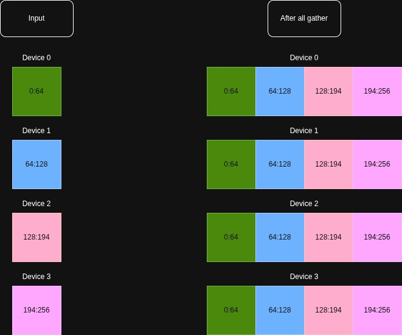

# All Gather

An all gather operation takes an array with an axis distributed over multiple chips, and exchanges the data from each chip to each other chip such that each chip ends up with a full view of the data. It basically "unshards" one or several axes.

For instance, a vector of length `256` whose single axis would be sharded over 4 devices:

Each chip initially holds 64 different elements. After the all gather, they all have a replicated view of the same 256 elements.
